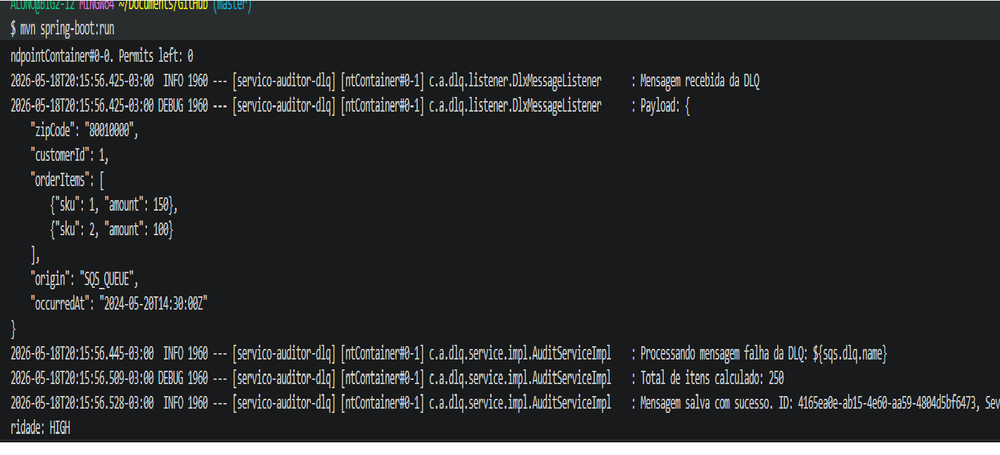
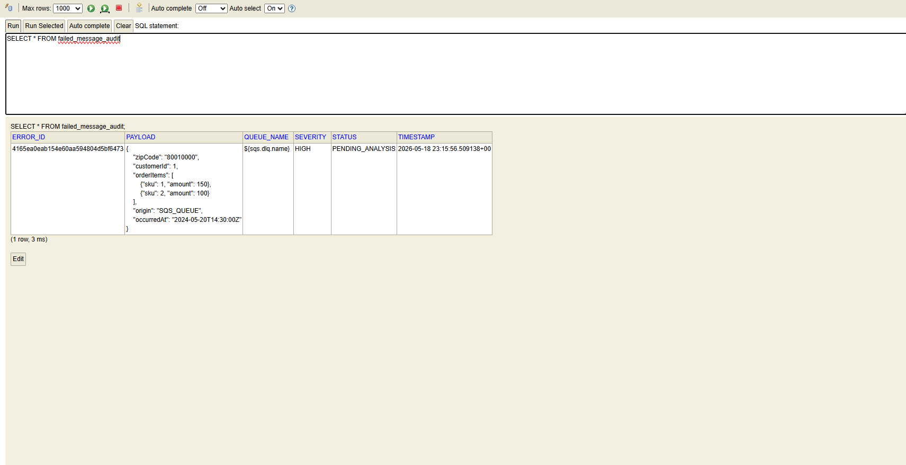

# Serviço Auditor de DLQ

## Descrição

Serviço que consome mensagens da Dead Letter Queue (DLQ) do SQS e persiste no banco H2 com classificação de severidade.

---

# Arquitetura: Layered Architecture

## Por que essa arquitetura?

Escolhi arquitetura em camadas porque:

### 1. Separa o que cada parte faz

- Listener: só escuta a fila
- Service: só calcula severidade
- Repository: só salva no banco

### 2. Fácil de dar manutenção

Se precisar trocar o banco (H2 para PostgreSQL), mexo só no Repository.

### 3. Dá pra testar cada pedaço separado

Consigo testar a regra de severidade sem precisar da fila SQS.

### 4. Simples e direto

Pra um serviço pequeno que só faz uma coisa, não precisava de arquitetura complexa tipo hexagonal.

---

# Estrutura do Projeto

```text
src/main/java/com/auditor/dlq/
├── DlxAuditorApplication.java
├── config/
│   └── EnvConfig.java
├── listener/
│   └── DlxMessageListener.java
├── service/
│   ├── AuditService.java
│   └── impl/
│       └── AuditServiceImpl.java
├── repository/
│   └── FailedMessageRepository.java
└── model/
    ├── dto/
    │   └── OrderMessageDTO.java
    └── entity/
        └── FailedMessageEntity.java
```

---

# Como funciona na prática

1. O `DlxMessageListener` recebe a mensagem da fila
2. Chama o `AuditServiceImpl`
3. Calcula total de itens: `150 + 100 = 250`
4. Aplica regra: `250 > 100` → Severidade `HIGH`
5. Salva no banco com `PENDING_ANALYSIS`
6. Remove mensagem da DLQ

---

# Regra de Severidade

Fiz do jeito que o exercício pediu:

```java
if (totalItems > 100) return "HIGH";
if (totalItems >= 50) return "MEDIUM";
return "LOW";
```

## Exemplos

- 250 itens → HIGH
- 75 itens → MEDIUM
- 30 itens → LOW

---

# Print do Terminal



## O que mostra

- Mensagem recebida da DLQ
- Payload com 250 itens (150 + 100)
- Total calculado: 250
- Severidade: HIGH
- ID gerado automaticamente
- Mensagem processada com sucesso

---

# Print do Banco H2



## Query utilizada

```sql
SELECT * FROM failed_message_audit;
```

## Resultado esperado

| errorId                             | queueName                       | severity | status           | timestamp           |
| ----------------------------------- | ------------------------------- | -------- | ---------------- | ------------------- |
| 4165ea0e-ab15-4e60-aa59-4805dbf6473 | T03N-BRAIAN-GASPAR-DA-ROSA.fifo | HIGH     | PENDING_ANALYSIS | 2026-05-18 23:11:19 |

---

# Funcionamento comprovado

Mensagem consumida da DLQ  
 Severidade calculada corretamente  
 Persistida no banco com ID único  
 Status = PENDING_ANALYSIS  
 Mensagem removida da fila após salvar

---

# Conclusão

O serviço atende todos os requisitos do exercício:

- Escuta a DLQ ativamente
- Calcula severidade por quantidade de itens
- Salva no banco com os campos pedidos
- Só remove da fila depois de persistir

A arquitetura em camadas foi a escolha certa porque mantém o projeto simples, organizado e fácil de manter.
